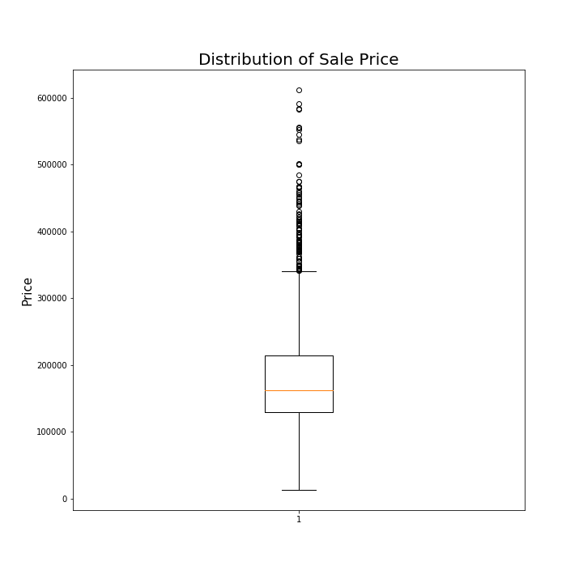
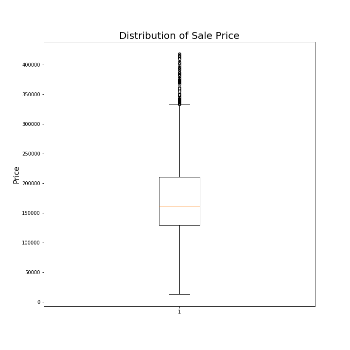
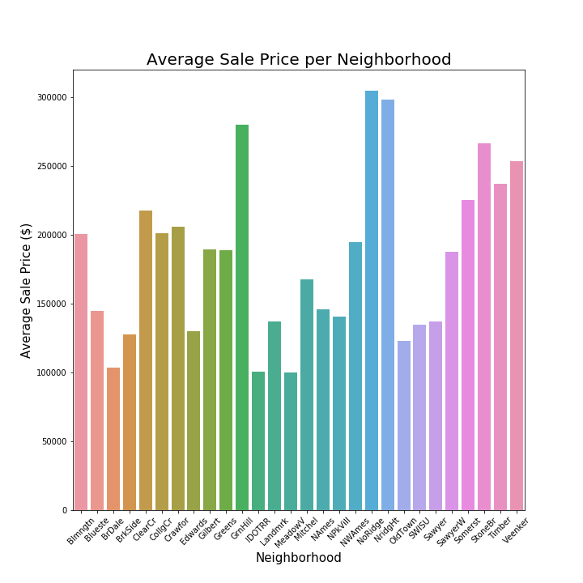

## Ame's Housing Data README
### Problem statement  
I will use housing data from Ames, Iowa to build a multiple linear regression model to predict housing prices in order to provide relevant information to realtors

### Description of data
The predictive model was built off of the training dataset and the predictions for Kaggle submissions were made with the test data set.     

Training data started with 2053 houses, but there were 33 outliers in the SalePrice category and 2 outliers in the Abv Gr Liv (Above Grade Living Area) category which were removed. I also dropped one house which had a null value for the garage area and one house which had a null value for basement square feet. This left data from 2014 houses.

The following features were used:

| Features used in Train Data | Feature Description                               |
|-----------------------------|---------------------------------------------------|
| 'Overall_Qual'              | Overall Quality, rated 1-10 (10 being highest)    |             
| 'Gr Liv Area'               | Above Grade Living Area, square feet above ground |             
| 'Garage Area'               | Square feet of garage                             |             
| 'Total Basement SF'         | Total square feet in basement                     |             
| '1st Flr SF'                | Square feet on first floor                        |             
| 'Year Built'                | Year the house was built                          |             
| 'Qual_Cond'                 | Overall Quality multiplied by the Overall Condition |           
| 'Garage Yr Blt'             | Year garage was built                             |             
| 'Kitchen AbvGr'             | Number of kitchens above grade (ground)           |             
| 'high_qual_fp'              | High quality fireplace (in excellent or good condition)  |       
| '4nbs'                      | Four neighborhoods (the 4 with the highest correlation to sale price)|
| 'SalePrice'                 | The actual sale price of the house                |             

The test data did not need any outliers removed. The test data consisted of data from 878 houses.

 Features used in test data (*Sale Price is not included as that was predicted for this dataset*):

| Features used in Test Data | Feature Description                               |
|-----------------------------|---------------------------------------------------|
| 'Overall_Qual'              | Overall Quality, rated 1-10 (10 being highest)    |             
| 'Gr Liv Area'               | Above Grade Living Area, square feet above ground |             
| 'Garage Area'               | Square feet of garage                             |             
| 'Total Basement SF'         | Total square feet in basement                     |             
| '1st Flr SF'                | Square feet on first floor                        |             
| 'Year Built'                | Year the house was built                          |             
| 'Qual_Cond'                 | Overall Quality multiplied by the Overall Condition |           
| 'Garage Yr Blt'             | Year garage was built                             |             
| 'Kitchen AbvGr'             | Number of kitchens above grade (ground)           |             
| 'high_qual_fp'              | High quality fireplace (in excellent or good condition)  |       
| '4nbs'                      | Four neighborhoods (the 4 with the highest correlation to sale price)|        

The original datasets were downloaded from General Assembly's Git Hub [here](https://git.generalassemb.ly/DSIR-720/project_2/tree/master/datasets).

Below are two boxplots showing the distribution of SalePrice in the train dataset. The first is before any data cleaning. The second is after outliers 3 z scores away from the mean were removed from the dataset.

### Model performance on training/test data
I used the training data to fit a multiple linear regression model, a ridge regression model, and a LASSO regression model. I ended up using my multiple linear regression model to predict the sale prices as it was the one which had the lowest RMSE score on the public Kaggle leaderboard.

I also used the LASSO regression model to gain some insight about the features I chose. The LASSO model scales all of the features so they can be compared against one another. The coefficients from this model show how much of an effect the feature has on predicting a sale price. If the coefficient is zero, that means the particular feature is not useful for predicting sale price. If the coefficient was zero in this model, I removed it from the multiple linear regression model to reduce the variance in my model.

After adding all of the features I wanted to use to my model (see the data dictionary below), I split my train dataset into train and test data. I fit the train data to my multiple linear regression model to determine each feature's coefficient. As each feature increases by one of it's respective unit, the house Sale Price is expected to change by the amount of the coefficient, in dollars.

| Features used in Train Data | Feature Description                               | Coefficient |
|-----------------------------|---------------------------------------------------|-------------|
| 'Overall_Qual'              | Overall Quality, rated 1-10 (10 being highest)    |5214.09             |
| 'Gr Liv Area'               | Above Grade Living Area, square feet above ground |49.06             |
| 'Garage Area'               | Square feet of garage                             |36.90             |
| 'Total Basement SF'         | Total square feet in basement                     |22.89             |
| '1st Flr SF'                | Square feet on first floor                        |20.06             |
| 'Year Built'                | Year the house was built                          |457.38             |
| 'Qual_Cond'                 | Overall Quality multiplied by the Overall Condition |1271.19             |
| 'Garage Yr Blt'             | Year garage was built                             |60.24             |
| 'Kitchen AbvGr'             | Number of kitchens above grade (ground)           |-20642.83             |
| 'high_qual_fp'              | High quality fireplace (in excellent or good condition)  |11435.83             |
| '4nbs'                      | Four neighborhoods (the 4 with the highest correlation to sale price)|21847.35             |

| Metric |Interpretation |Train | Test |
|--------|---------------|------|------|
| R2 | How much variance is accounted for by the model    |86% |83%|
| RMSE | Average error in the predicted price |$26,649.66 |$23,911.80|

After using the training portion of the train dataset, I used the model to predict sale price with the both the train and test groups of data. This allowed me to compare the predicted value from my model to the actual sale price. The diagonal line in the graphs below is where the sale price is equal to the predicted price, meaning the prediction was exact. Below are two scatter plots demonstrating the actual price versus the predicted price from the multiple linear regression model - one from the train dataset training portion, and one from the train dataset testing portion.

### Answers to Frequently Asked Questions (from Realtors):
- Which features appear to add the most value to a home?
  - As above grade living area goes up one square foot, sale price is predicted to increase $50.60 assuming all else stays the same
Year Built
  - As the year built increases by year, the sale price is predicted to increase $459.94
- Which features hurt the value of a home the most?
  - As the number of kitchens above grade, the sale price is predicted to decrease $22,808.26
    - Keep in mind that most houses only have one kitchen, but having more than one might actually decrease the value.
- What are things that homeowners could improve in their homes to increase the value?
  - An addition to increase the above grade living area
  - Any small upgrades (you cannot change the year the house was built, but you can change the year the interior was upgraded!)
- What neighborhoods seem like they might be a good investment?
  - The top 4 neighborhoods had the following average sale prices:
    - North Ridge: $304,469.29
    - Northridge Heights: $298,050.07
    - Green Hills: $280,000.00
    - Stone Brook: $266,656.89

- Do you feel that this model will generalize to other cities? How could you revise your model to make it more universal OR what date would you need from another city to make a comparable model?
  - No, because this data is only for Ames and it might not be accurate for other cities. If we gather data from other cities or states, then we can incorporate that into the model and use it to predict those locations as well.

### Next steps

It was brought to my attention during my presentation that I should have checked all of my missing values in Garage Year as some of these houses may not have had a garage.  While I am mad at myself for making such an avoidable mistake, I am glad I made it now. I've learned my lesson to look closer at missing data before I decide what to do with it. I am glad I am learning this lesson now! My notebooks have been updated to correct my mistake. 

After the program (when I have free time), I would also like to maybe add more features and try to lower my RMSE even more (without compromising variation)!

A more hypothetical next step would be to gather housing information for other cities to incorporate into the model so the model can predict price in other cities as well.

### References
[Adding images in markdwon](https://medium.com/markdown-monster-blog/getting-images-into-markdown-documents-and-weblog-posts-with-markdown-monster-9ec6f353d8ec)   

[What to do with outliers](https://towardsdatascience.com/ways-to-detect-and-remove-the-outliers-404d16608dba)  

[Adding a line onto a scatter plot](https://stackoverflow.com/questions/40516661/adding-line-to-scatter-plot-using-pythons-matplotlib)  

[Data Source](https://git.generalassemb.ly/DSIR-720/project_2/tree/master/datasets)

[Data dictionary](https://www.kaggle.com/c/dsir-720-project-2-regression-challenge/data)

General Assemb.ly's DSIR Lessons!

### Directory
project-2  
|__ code  
|   |__ submission1.ipynb   
|   |__ submission2.ipynb   
|   |__ submission3.ipynb  
|   |__ submission4.ipynb    
|   |__ submission5.ipynb  
|   |__ submission6.ipynb    
|   |__ submission7.ipynb  
|   |__ submission8.ipynb  
|__ datasets  
|   |__ dana_submission_1.csv  
|   |__ dana_submission_2.csv  
|   |__ dana_submission_3.csv  
|   |__ dana_submission_4.csv  
|   |__ dana_submission_5.csv  
|   |__ dana_submission_6.csv  
|   |__ dana_submission_7.csv  
|   |__ dana_submission_8.csv  
|   |__ dana_submission_9.csv  
|   |__ test.csv  
|   |__ test1.csv  
|   |__ test2.csv  
|   |__ test3.csv  
|   |__ train.csv  
|   |__ train1.csv  
|   |__ train2.csv  
|   |__ train3.csv  
|   |__ train4.csv  
|__ images  
|   |__ actual_pred_test.png  
|   |__ actual_pred_train.png  
|   |__ avg_price_neighborhood.png  
|   |__ price_dist_no_outliers.png  
|   |__ price_dist_outliers.png  
|__ project2.pdf  
|__ README.md  
